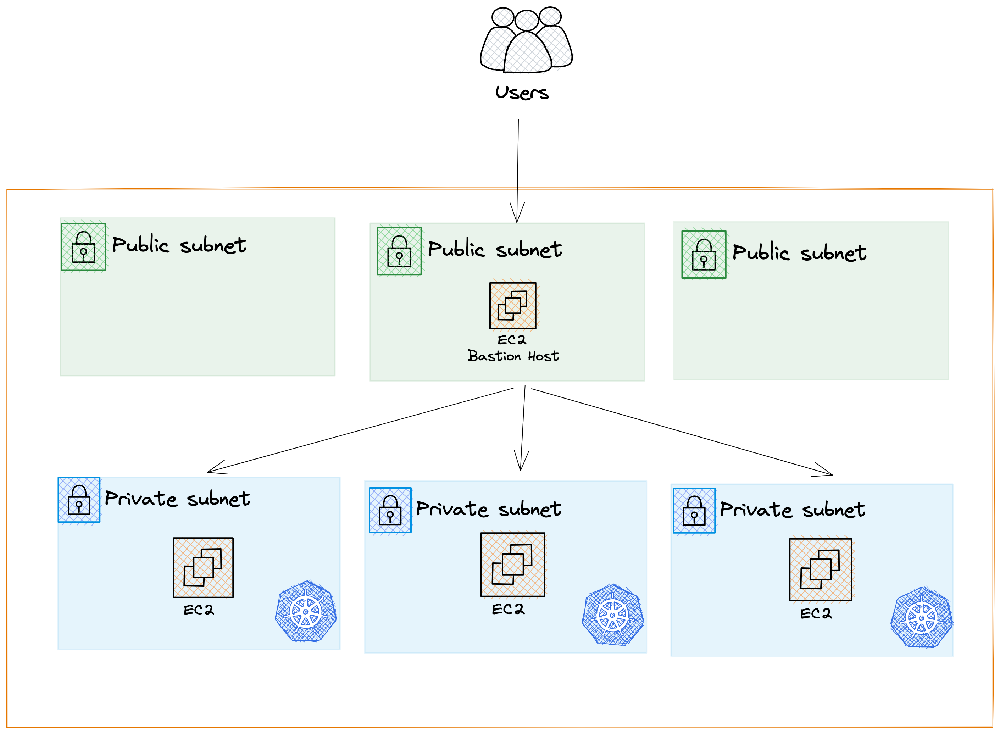
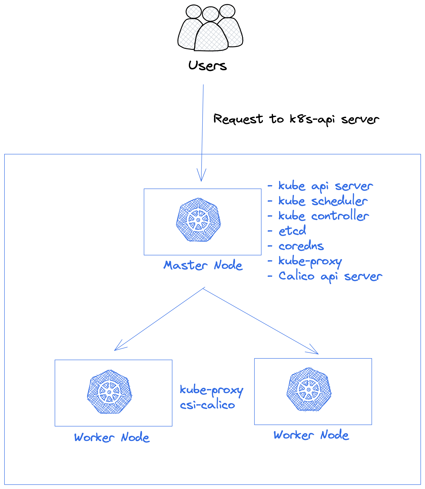

# kubeadm-aws

This Repository allow you to deploy a basic aws infrastructure to deploy a kubernetes cluster with 1 master node and two worker node.

### Architecture



### Requirements

- A valid aws credentials
- terraform >= `1.3.6`

### Quick start

- Clone the repository  `git@github.com:braybaut/kubeadm-aws.git`
- Create the infrastructure with the following command, you need to define two variables: `owner` and `key_name`

> :warning: You need to create a [Key Pair](https://docs.aws.amazon.com/servicecatalog/latest/adminguide/getstarted-keypair.html) before stating to create the infrastructure

```tf
terraform plan -var="owner=<owner_name>" -var="key_name=<key_name>"
```

- As soon as the infrastructure is created you can connect to the instances through Bastion Host, terraform create outputs with the public and private address to connect.

- Follow the kubernetes official Documentation to create the following cluster.


